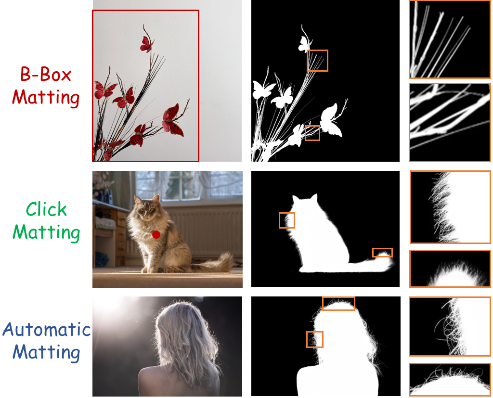
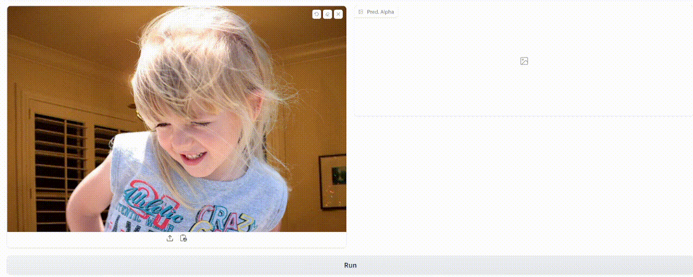

<div align="center">
<!-- <h2>Click2Trimap</h2> -->
<h1>MattePro: A Professional Matting Model for Anything </h1>

Chenyi Zhang*, Yiheng Lin*, Ting Liu, Xiaochao Qu, Luoqi Liu, Fang Zhao, Yao Zhao, Yunchao Wei<sup>+</sup>

Beijing Jiaotong University   | MT Lab, Meitu Inc  | Nanjing University


<p align="center">
    <a href="https://opensource.org/licenses/MIT">
        
    <!-- </a> -->
    <a href="">
        
    </a>   

</p>
</div>


## Introduction
<p align="middle">
  
</p>

<p align="center" style="font-size: 18px; font-weight: bold;">a matting method that supports various forms of interaction</p>


## Results

| Model                | AIM-500 MSE ↓ | AIM-500 SAD ↓ | Comp-1K MSE ↓ | Comp-1K SAD ↓ |  P3M-500-NP MSE ↓ | P3M-500-NP SAD ↓ | 
| :-------------------- | :-------------: | :-------------: |  :--------------: | :--------------: | :----------------: | :----------------: | 
| MatteAnything    | 36.97         | 81.50         | 51.33         | 157.97        |  28.98            | 58.91            | 
| MattingAnything  | 14.48         | 42.63         | 26.76         | 123.60        |  9.21             | 25.82            | 
| SmartMatting     | 7.65          | 25.32         | 31.23         | 122.38        |  3.73             | 14.11            |
| SEMatte         | 7.07          | 24.30         | 7.44          | 57.00         | 2.76             | 10.88            | 
| **MattePro (Ours)**  | **3.93**      | **18.75**     | **5.67**      | **39.09**     |  **2.17**         | **10.11**        |


## Quick Installation 
Run the following command to install required packages. 
```
conda create -n mattepro python==3.10
conda activate mattepro
```
```
pip install torch==2.4.1 torchvision==0.19.1 torchaudio==2.4.1 --index-url https://download.pytorch.org/whl/cu121
```
```
pip install -r requirements.txt
```
Install [detectron2](https://github.com/facebookresearch/detectron2) please following its [document](https://detectron2.readthedocs.io/en/latest/), you can also run following command
```
python -m pip install 'git+https://github.com/facebookresearch/detectron2.git'
```


## Demo

### Image Matting

<p align="left">
  
</p>


**Step 1.**   
Download the pretrained weights of [MattePro](https://drive.google.com/file/d/1b8eXjzDRPfF_SU-4nULc_YUZ9ytDqekh/view?usp=sharing) and [MEMatte](https://drive.google.com/file/d/1R5NbgIpOudKjvLz1V9M9SxXr1ovAmu3u/view?usp=sharing), and place them in the weights directory.   
```
weights/
├── MattePro.pth
└── MeMatte.pth
```
**Step 2.**   
```
python demo_image_matting.py
```
**Tips for Click Mode:**  
Click the left mouse button on foreground region  
Click the roll mouse button on unknown region  
Click the right mouse button on background region  
### Video Matting


https://github.com/user-attachments/assets/3679399f-b29d-4dd8-9c9b-002704b14491


https://github.com/user-attachments/assets/0aeb14bd-86c5-4467-bc30-b8b6b82f7ceb


**Step 1.**   
Download the weight of [BirefNet](https://drive.google.com/file/d/1f7L0Pb1Y3RkOMbqLCW_zO31dik9AiUFa/view), and place them in the weights directory.   
```
weights/
├── MattePro.pth
├── MeMatte.pth
└── BiRefNet-HRSOD_D-epoch_130.pth
```

**Step 2.** 
```
python demo_video_matting.py --input-path 'videos/hair.mp4'
```

ps:This mode is under research and currently only supports salient video matting.


## Evaluate

examples:


**B-Box Matting Mode** 
```
python evaluate.py --testset AIM500
```

ps: If your GPU memory is limited, please set pachify to True.

## Train

MattePro is a two-stage workflow.   
### First stage ###
This stage can be trained within 24 hours using a single GPU(memory > 10GB).   


**Step 1: Download Dataset**

Segmentation Dataset:   [DUTS](https://saliencydetection.net/duts/), [DIS5K](https://xuebinqin.github.io/dis/index.html)

Matting Dataset:   [DIM](https://sites.google.com/view/deepimagematting), [Distinctions-646](https://github.com/yuhaoliu7456/CVPR2020-HAttMatting?tab=readme-ov-file),  [AM-2K](https://github.com/JizhiziLi/GFM),  [P3M-10k](https://github.com/JizhiziLi/P3M),  [Transparent-460](https://github.com/AceCHQ/TransMatting)

Background Images: [COCO2017](https://cocodataset.org/#home)

And then configure the path in in [config.yml](https://github.com/ChenyiZhang007/MattePro/blob/main/config.yml)


**Step 2: Pretrained SAM2 Checkpoint**  

Download checkpoint of [SAM2 large](https://dl.fbaipublicfiles.com/segment_anything_2/092824/sam2.1_hiera_large.pt), and place it in the pretrained directory

```
pretrained/
└── sam2.1_hiera_large.pt
```


**Step 3:**

```
python train.py
```

### Second stage ###

For the second stage, you can refer to [MEMatte](https://github.com/linyiheng123/MEMatte) for training, or directly use our pre-trained [MEMatte checkpoint](). You can even replace MEMatte with any trimap-based matting model(e.g., [ViTMatte](https://github.com/hustvl/ViTMatte) or [AEMatter](https://github.com/aipixel/AEMatter), though this will require some minor necessary modifications to the code), and it still produces excellent results.


<!-- ## Citation
If you have any questions, please feel free to contact me via chenyi22@bjtu.edu.cn. If you find our method or dataset helpful, we would appreciate it if you could give our project a star ⭐️ on GitHub and cite our paper:
```bibtex
@inproceedings{lin2025memory,
  title={Memory Efficient Matting with Adaptive Token Routing},
  author={Lin, Yiheng and Hu, Yihan and Zhang, Chenyi and Liu, Ting and Qu, Xiaochao and Liu, Luoqi and Zhao, Yao and Wei, Yunchao},
  booktitle={Proceedings of the AAAI Conference on Artificial Intelligence},
  volume={39},
  number={5},
  pages={5298--5306},
  year={2025}
}
``` -->

## License
The code is released under the MIT License. It is a short, permissive software license. Basically, you can do whatever you want as long as you include the original copyright and license notice in any copy of the software/source. 

## Acknowledgement
Our project is developed based on [SEMatte](https://github.com/XiaRho/SEMat), [MEMatte](https://github.com/linyiheng123/MEMatte), [SimpleClick](https://github.com/uncbiag/SimpleClick?tab=readme-ov-file), [BiRefNet](https://github.com/ZhengPeng7/BiRefNet). Thanks for their wonderful work!<div align="center">
